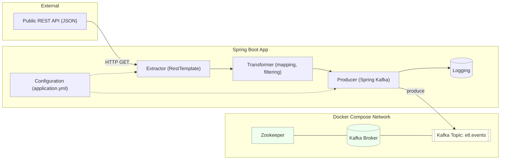

# Data Latte — Java ETL Pipeline

### Overview
Data Latte is a **Spring Boot 3** ETL that **extracts** data from a REST API, **transforms** it, and **loads** it into a **Kafka topic** (`etl.events`).  
Target: **MVP v0.1 by Oct 29 2025.**
---
### Tech Stack
- Java 17
- Spring Boot 3 (Web, Kafka)
- Kafka (single-node via Docker Compose)
- Maven 3.9+
- JUnit 5 / Mockito 5
- IntelliJ IDEA

---

### Prerequisites
```bash
java -version
mvn -version
docker --version && docker compose version
```

---

## Run and Test Locally
### 1) Start Kafka
```bash
docker compose up -d
```
check:
```bash
docker ps
```

### 2 Create topics
```bash
docker exec -it kafka kafka-topics --create \
  --topic etl.github.events --bootstrap-server localhost:9092 \
  --partitions 1 --replication-factor 1 \
  --config retention.ms=$((7*24*60*60*1000))
```

```bash
docker exec -it kafka kafka-topics --describe \
  --topic etl.github.events --bootstrap-server localhost:9092
```

### 3) Start a consumer

```bash
docker exec -it kafka kafka-console-consumer \
--bootstrap-server localhost:9092 \
--topic etl.github.events --from-beginning \
--property print.key=true --property print.headers=true
```
Leave this running.

### 4) Run the app

```bash
mvn -q -DskipTests spring-boot:run
```

### To stop:
```bash
docker compose down
```
 ### Clean slate
```bash
docker compose down -v
docker system prune -af
docker volume ls | awk '/kafka|zookeeper/ {print $2}' | xargs -r docker volume rm
```

## Architecture Diagram



